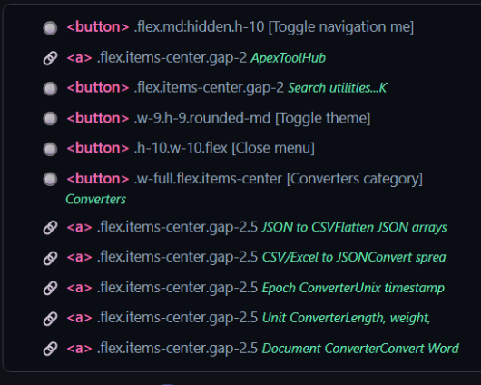
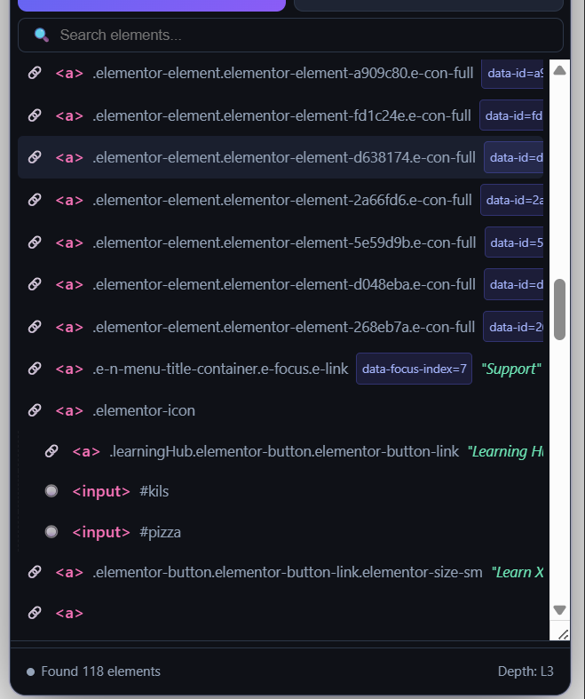

# Element Inspector Pro 🔍

A premium, state-of-the-art Google Chrome extension designed for QA engineers and developers. **Element Inspector Pro** scans web pages, pierces Shadow DOMs, and generates clean, reliable test-automation selectors and code snippets for Playwright, Selenium, and Cypress in Java and Python.

---

## 🎨 Preview

Here is a look at the modern, dark-themed user interface:

### Main Interface & Element Tree


### Selected Elements & Generated Code Snippets


---

## ✨ Features

- **Element Highlighting & Hover Inspection** – Hover over page elements to view bounds with a beautiful cyan overlay and tooltip.
- **Hierarchical Tree View** – Scans and renders a vertical-guided DOM node tree with micro-animations.
- **Accurate Attribute Badges**:
  - `INTERACTIVE` – Highlights links, buttons, inputs, and other interactive elements.
  - `SHADOW HOST` – Identifies components hosting an open Shadow DOM.
  - `SHADOW` – Identifies elements nested deep inside Shadow Roots.
- **Multi-Framework Code Generation**:
  - **Playwright** (Java/Python CSS & XPath locators)
  - **Selenium** (Java/Python CSS & XPath locators, with native `executeScript` shadow root piercing)
  - **Cypress** (JavaScript CSS & XPath locators, with native `.shadow().find()` chain generation)
- **Settings Accordion** – Collapse configuration options (Scope, Framework, Language, Selector Type) to save vertical screen space.
- **Draggable & Resizable Panel** – Drag the floating panel anywhere on your screen and drag the boundary to resize the Tree View vertically.
- **Dark/Light Mode Support** – Toggle between a dark dashboard theme and a crisp light theme with a single click.

---

## 📦 Installation

1. **Download/Clone this Repository**:
   - Alternatively, you can download the pre-packaged **[ElementInspectorPro.zip](../ElementInspectorPro.zip)** directly.
   - Or clone the repository using Git:
     ```bash
     git clone https://github.com/nirakumar/ElementInspectorPro.git
     cd ElementInspectorPro
     ```

2. **Load the Unpacked Extension in Chrome**:
   - Open Chrome and navigate to `chrome://extensions/`.
   - Toggle **Developer mode** in the top-right corner.
   - Click the **Load unpacked** button in the top-left.
   - Select the `ElementInspectorPro` folder containing the `manifest.json`.

3. **Verify the Icon**:
   - You should see the custom magnifying glass target icon added to your extensions bar:
   
   

---

## 🛠️ Usage

1. **Activate the Inspector**:
   - Click the **Element Inspector Pro** extension icon in your Chrome toolbar.
   - Click **Open Inspector** to launch the overlay panel on the current tab.

2. **Hover Mode**:
   - Click **🖱 Hover Mode** to inspect elements on the fly.
   - Hovering highlights elements with a cyan box and details tag/React components.
   - Click any highlighted element to add it directly to your selected list.
   - Press `Esc` or click **Hover Active** again to exit.

3. **Page Scan**:
   - Click **⚡ Scan Page** to scan the active page's DOM structure.
   - Browse the dense vertical guide lines to inspect elements.
   - Hover over nodes in the list to highlight their corresponding element on the page.
   - Click the **`+`** button on the right side of a tree item to add it to your selection list.

4. **Generate & Copy Code**:
   - Expand the **Configuration Settings** accordion to set your target Framework, Language, and Selector Type.
   - All added elements appear under the **Selected Elements** panel.
   - Copy CSS/XPath selectors inline, or copy the entire generated locator code snippet with a single click.
   - Click **⬇ Export** to export all selectors in JSON or CSV format.

---

## 👨‍💻 Tech Stack

- **Core**: Vanilla HTML5, JavaScript (ES6)
- **Styling**: Modern CSS3 using HSL variables, flexbox/grid layout, and CSS absolute alignments.
- **Icons**: Custom high-visibility target magnifying glass designs.

---

## 📄 License

This project is licensed under the **MIT License** – see the `LICENSE` file for details.
